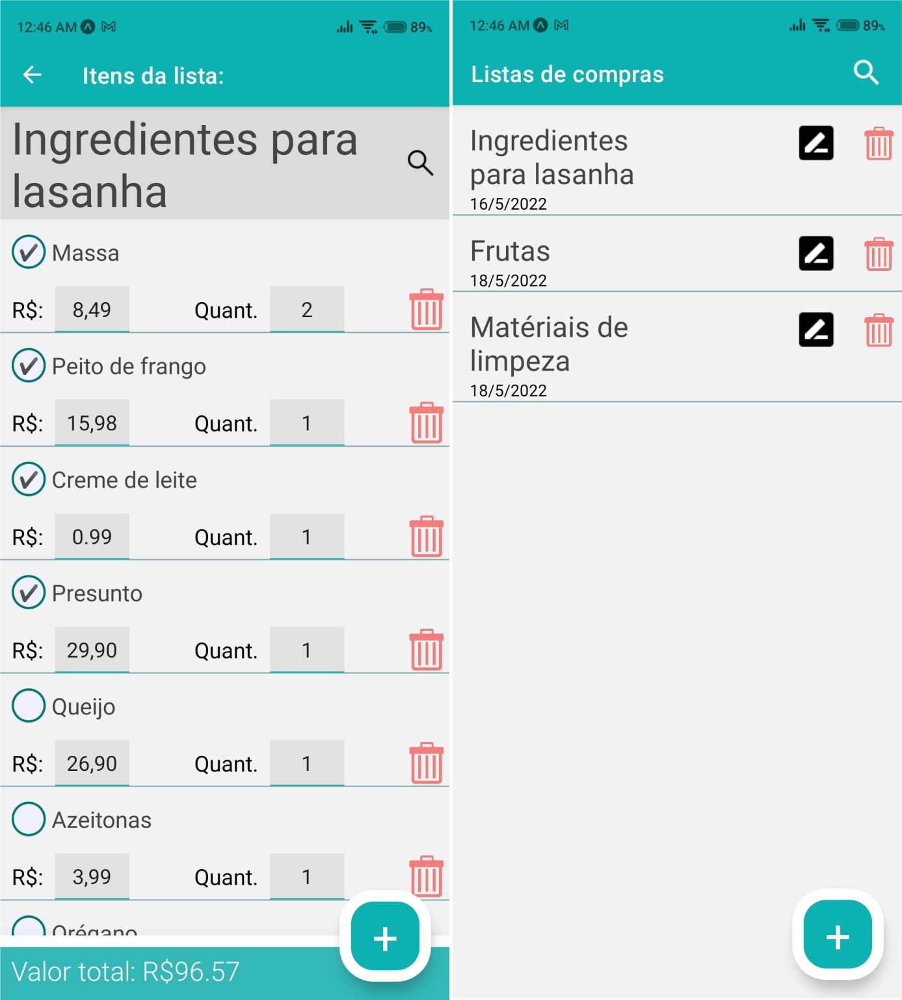

# Aplicativo-ShoppingList-React-Native

## Descrição:
Aplicativo para gerenciamento de listas de compras desenvolvido para Android com React Native Expo.

## Funcionalidades: 
Listar, buscar, criar, editar e excluir listas de compras.\
Listar, buscar, criar, editar e excluir itens das listas de compras.

Detalhes sobre as funcionalidades estão descritas em comentários do código.

## Dependências:

### React Navigation:
`npm install @react-navigation/native`\
`npm install react-native-screens react-native-safe-area-context`\
`npm install @react-navigation/native-stack`

### Async Storage:
`expo install @react-native-async-storage/async-storage`
